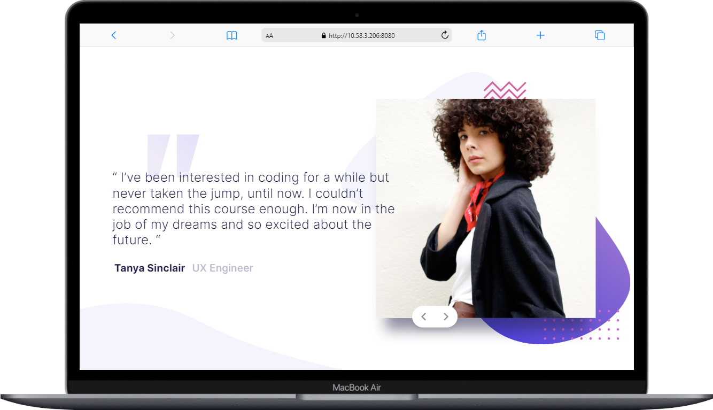

# Testimonial Slider w/ Vue & Tailwind

This is a solution to the [Coding bootcamp testimonials slider challenge on Frontend Mentor](https://www.frontendmentor.io/challenges/coding-bootcamp-testimonials-slider-4FNyLA8JL). 

## Table of contents

- [Overview](#overview)
  - [The challenge](#the-challenge)
  - [Screenshot](#screenshot)
  - [Links](#links)
- [My process](#my-process)
  - [Built with](#built-with)
  - [What I learned](#what-i-learned)
  - [Continued development](#continued-development)
- [Author](#author)

**Note: Delete this note and update the table of contents based on what sections you keep.**

## Overview

### The challenge

Users should be able to:

- Make the design responsive across most common screen sizes
- Make it possible to navigate the slider with mouse or keyboard
- Create the design using Tailwind CSS

### Screenshot

&nbsp;

&nbsp;

&nbsp;

&nbsp;

&nbsp;

### Links

- Live Site URL: [Add live site URL here](https://your-live-site-url.com)

## My process

### Built with

- Semantic HTML5 markup
- Tailwind CSS
- Vue
- Mobile-first workflow
- [Vue](https://vuejs.org/) - JS library
- [TailwindCSS](https://tailwindcss.com/) - CSS framework

### What I learned

During this challenge I have been working with Vue.js to get a better hold on the basics of using reuseable components and passing data with props with Vue. 
It's been a joy and I'm really starting to enjoy the framework. 

I added TailwindCSS which is used to style the overall design layout. During this project I learned how to configure TailwindCSS whenever i need a custom utility class. 

### Continued development

Next step in this project is to add some JS functionality so the user can change slides with a press on the keyboard

## Author

- Website - [Andreas Bruhn](https://www.andreasbc.dk/)
- Frontend Mentor - [@AndreasBruhn](https://www.frontendmentor.io/profile/AndreasBruhn)
